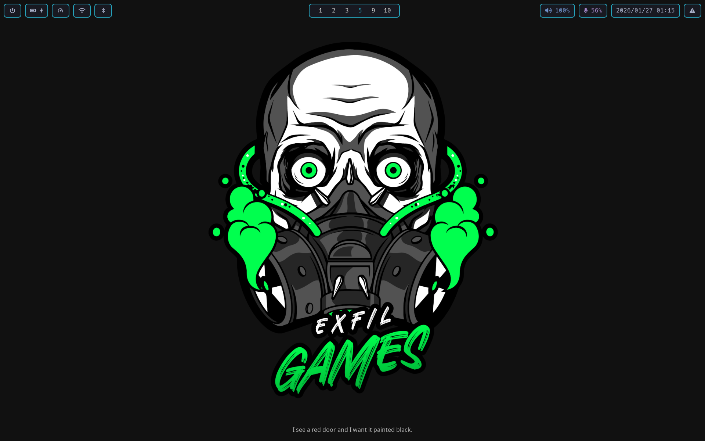

# .files

My personal dotfiles for a consistent and productive Linux environment.



## Philosophy

These dotfiles are curated to provide a sleek, modern, and efficient workflow.
The setup is based on Hyprland, a dynamic tiling Wayland compositor, and a set
of carefully selected tools that enhance productivity and user experience. The
color scheme is based on the popular
[TokyoNight](https://github.com/folke/tokyonight.nvim) theme.

## Core Components

- **Window Manager**: [Hyprland](https://hyprland.org/) - A dynamic tiling
  Wayland compositor with a focus on animations and smooth user experience.
- **Shell**: [Fish](https://fishshell.com/) - A smart and user-friendly
  command-line shell.
- **Terminal**: [Alacritty](https://alacritty.org/) - A fast, GPU-accelerated
  terminal emulator.
- **Editor**: [Neovim](https://neovim.io/) - A highly extensible, Vim-based text
  editor, configured with [LazyVim](https://www.lazyvim.org/).
- **Bar**: [Waybar](https://github.com/Alexays/Waybar) - A highly customizable
  Wayland bar for Sway and Wlroots based compositors.
- **Application Launcher**: [Rofi](https://github.com/davatorium/rofi) - A
  versatile application launcher and window switcher.
- **Notification Daemon**: [swaync](https://github.com/Lentera/swaync) - A
  simple notification daemon for Wayland.

## Key Features

- **Consistent Theming**: A consistent TokyoNight theme is applied across all
  applications, including Alacritty, Neovim, Waybar, and Rofi.
- **Custom Scripts**: A collection of useful scripts are available in
  `.local/bin` to automate common tasks.
- **Keybindings**: Intuitive keybindings are configured in `hyprland.conf` for
  efficient window management and application launching.
- **Fish Shell**: The fish shell is configured with useful aliases, functions,
  and a [Starship](https://starship.rs/) prompt. It also integrates with `fzf`
  and `zoxide`.
- **Neovim**: A full-featured Neovim setup based on LazyVim with plugins for
  LSP, linting, formatting, and more.

## Required packages

Required packages are installed on first run of `.update` script but if you want
to run it manually you can just run the following:

### Short URL (.deps)

```sh
curl -SsL https://ba.sh/zNcw | sh
```

### Raw URL (.deps)

```sh
curl -SsL https://raw.github.com/mxaddict/dotfiles/main/.local/bin/.deps | sh
```

## Installation

Just run this to setup the dotfiles:

### Short URL (.update)

```sh
curl -SsL https://ba.sh/yar3 | sh
```

### Raw URL (.update)

```sh
curl -SsL https://raw.github.com/mxaddict/dotfiles/main/.local/bin/.update | sh
```

## License

This project is licensed under the MIT License - see the [LICENSE](LICENSE) file
for details.
