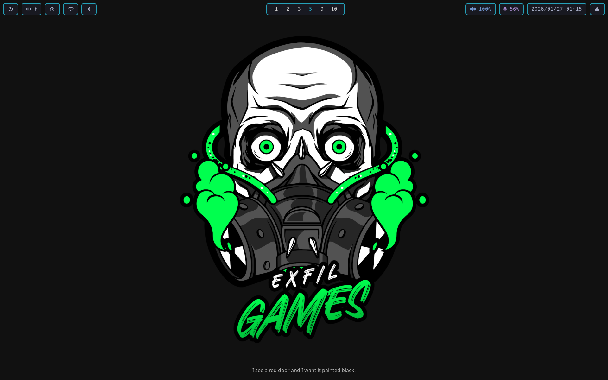

# .files

My personal dotfiles for a consistent and productive Linux environment.



## Philosophy

These dotfiles are curated to provide a sleek, modern, and efficient workflow.
The setup is based on Hyprland, a dynamic tiling Wayland compositor, and a set
of carefully selected tools that enhance productivity and user experience. The
color scheme is based on the popular
[TokyoNight](https://github.com/folke/tokyonight.nvim) theme.

## Prerequisites

- **Distro**: Arch Linux (or an Arch derivative). `.deps` uses `pacman` + `paru`
  exclusively — other distros are unsupported out of the box.
- **Display server**: Wayland (Hyprland). X11 will not work.
- **GPU**: Any modern GPU with a working Wayland driver. Tested on AMD; NVIDIA
  may need additional Hyprland config tweaks.
- **CPU**: x86_64. ARM is untested.
- **Required CLI**: `git`, `bash`, `curl`, `stow`. Everything else `.deps`
  installs.
- **Recommended**: Familiarity with Vim keybindings (Neovim, Vieb, tmux).

### Runtime assets

`.deps` installs these on Arch. On other distros, install equivalents manually
or glyphs / cursors / icons will render as boxes:

- **Font**: [Hack Nerd Font](https://www.nerdfonts.com/) — used by Alacritty,
  Waybar, Rofi. Arch package: `ttf-hack-nerd`.
- **Cursor theme**: `Breeze_Light` — set via `HYPRCURSOR_THEME` /
  `XCURSOR_THEME` in `hyprland.conf`. Arch package: `breeze`.
- **GTK theme**: `adw-gtk-theme`.
- **Icon theme**: whatever your distro ships; Nautilus + Waybar both rely on the
  default GTK icon theme.

## Core Components

- **Window Manager**: [Hyprland](https://hyprland.org/) — dynamic tiling Wayland
  compositor.
- **Shell**: [Fish](https://fishshell.com/) — friendly interactive shell.
- **Terminal**: [Alacritty](https://alacritty.org/) — GPU-accelerated terminal.
- **Editor**: [Neovim](https://neovim.io/) with
  [LazyVim](https://www.lazyvim.org/).
- **Bar**: [Waybar](https://github.com/Alexays/Waybar).
- **Launcher**: [Rofi](https://github.com/davatorium/rofi).
- **Notifications**: [swaync](https://github.com/Lentera/swaync).
- **File Manager**: [Nautilus](https://help.gnome.org/users/nautilus/).
- **Browser**: [Vieb](https://github.com/Jelmerro/Vieb) — vim-like browser.
- **Screenshot**: [Grimblast](https://github.com/hyprwm/contrib).
- **System monitor**: [btop](https://github.com/aristocratos/btop).
- **Prompt**: [Starship](https://starship.rs/).

## Installation

> ⚠ The install scripts assume Arch Linux and will install many packages via
> `paru`. Read `.local/bin/.deps` before running.

### Quick install (curl pipe)

```sh
curl -SsL https://ba.sh/yar3 | sh
```

Raw URL:

```sh
curl -SsL https://raw.github.com/mxaddict/dotfiles/main/.local/bin/.update | sh
```

### Manual install (recommended for skeptics)

```sh
git clone https://github.com/mxaddict/dotfiles.git ~/.files
~/.files/.local/bin/.update --dry-run     # pull only, no changes applied
~/.files/.local/bin/.update               # full install
```

### First-run wizard (recommended for fresh installs)

After cloning, run the interactive setup. It collects your identity + key
defaults up front, then runs `.update` and patches the seeded templates with
your answers — single hands-on pass for a fresh install.

```sh
~/.files/.local/bin/.setup            # interactive
~/.files/.local/bin/.setup -y         # accept all defaults, no prompts
~/.files/.local/bin/.setup --no-update  # only prompt + patch, skip .update
```

Re-running is safe: every prompt shows the current value as its default; press
Enter to keep it.

### Forking

Replace the repo URL via env var so `.update` clones your fork:

```sh
DOTFILES_REPO="https://github.com/you/dotfiles.git" ~/.files/.local/bin/.update
```

### Just install deps

```sh
curl -SsL https://ba.sh/zNcw | sh
# or
curl -SsL https://raw.github.com/mxaddict/dotfiles/main/.local/bin/.deps | sh
```

## First-run customization

### Template seeding

User-specific files live as `*.template.*` in the repo and are **copied to
`$HOME` on first run** by `.update`. The destinations are gitignored and ignored
by `stow`, so your local edits never get clobbered by a `git pull`.

| Template (repo)                        | Destination                     | Purpose                                |
| -------------------------------------- | ------------------------------- | -------------------------------------- |
| `.gitconfig.local.template`            | `~/.gitconfig.local`            | Name, email, GPG signing               |
| `.config/hypr/apps.template.conf`      | `~/.config/hypr/apps.conf`      | `$terminal`, `$browser`, `$lock`, etc. |
| `.config/hypr/input.template.conf`     | `~/.config/hypr/input.conf`     | Keyboard layout, touchpad              |
| `.config/hypr/monitors.template.conf`  | `~/.config/hypr/monitors.conf`  | Monitor positions                      |
| `.config/hypr/hyprpaper.template.conf` | `~/.config/hypr/hyprpaper.conf` | Wallpaper                              |

Re-running `.update` is safe — it only seeds files that don't exist yet.

### Files you almost certainly want to edit

1. `~/.gitconfig.local` — name, email, optional GPG key, optional signing.
2. `~/.config/hypr/monitors.conf` — run `hyprctl monitors` for display names.
3. `~/.config/hypr/apps.conf` — swap terminal, browser, file manager defaults.
4. `~/.config/hypr/input.conf` — change `kb_layout` if you're not on US.

### Optional edits

- `~/.config/hypr/workspaces.conf` — pin workspaces to monitors.
- `~/.config/hypr/hyprpaper.conf` — change wallpaper path.
- `.codex/config.toml` and `.config/opencode/opencode.json` — point Ollama at
  your host (default: `localhost:11434`).

## Keybinding Cheatsheet (Hyprland)

`$mod` = **Super** (Windows key).

### Apps & menus

| Bind                  | Action                         |
| --------------------- | ------------------------------ |
| `$mod + return` / `c` | Terminal (Alacritty)           |
| `$mod + b`            | Browser                        |
| `$mod + e`            | File manager (Nautilus)        |
| `$mod + space`        | App launcher                   |
| `$mod + r`            | Calculator                     |
| `$mod + .`            | Emoji picker                   |
| `$mod + w`            | WiFi menu                      |
| `$mod + a`            | Audio menu                     |
| `$mod + u`            | Bluetooth menu                 |
| `$mod + t`            | Time menu                      |
| `$mod + escape`       | Top processes menu             |
| `$mod + shift + m`    | Power menu                     |
| `$mod + n` / `+S+n`   | Toggle / dismiss notifications |

### Screen

| Bind                 | Action                |
| -------------------- | --------------------- |
| `$mod + p` / `Print` | Screenshot region     |
| `$mod + shift + p`   | Screen record (kooha) |
| `$mod + ctrl + p`    | Color picker          |
| `$mod + m`           | Lock screen           |

### Window management

| Bind                     | Action                   |
| ------------------------ | ------------------------ |
| `$mod + q`               | Close active window      |
| `$mod + f`               | Maximize (fullscreen-1)  |
| `$mod + shift + f`       | True fullscreen          |
| `$mod + v`               | Toggle floating          |
| `$mod + s`               | Toggle split direction   |
| `$mod + h/j/k/l`         | Focus left/down/up/right |
| `$mod + shift + h/j/k/l` | Move window              |
| `ctrl + arrows`          | Resize active window     |
| `$mod + tab`             | Cycle windows            |

### Workspaces

| Bind                  | Action                    |
| --------------------- | ------------------------- |
| `$mod + 1..9,0`       | Switch to workspace 1..10 |
| `$mod + shift + 1..0` | Move window to workspace  |
| `$mod + LMB drag`     | Move window               |
| `$mod + RMB drag`     | Resize window             |

### Autofill (password manager menu)

| Bind              | Action   |
| ----------------- | -------- |
| `$mod + ctrl + j` | Auth     |
| `$mod + ctrl + k` | Username |
| `$mod + ctrl + l` | Password |
| `$mod + ctrl + ;` | OTP      |

### Audio / brightness

`XF86Audio*` and `XF86MonBrightness*` keys are wired via `swayosd-client`.
`$mod + up/down/left/right` doubles as volume +/-/mute. Add `shift` for mic.

## Convention: dotfile-prefixed scripts

Scripts in `.local/bin/` are intentionally named with a leading `.` (e.g.
`.menu-apps`, `.update`). They are hidden from a plain `ls` but show up with
`ls -A`. This keeps the user's "real" PATH visually clean. Use
`ls -A ~/.local/bin/` to discover them.

## Update workflow

```sh
~/.local/bin/.update              # update repo + deps + plugins
~/.local/bin/.update --dry-run    # pull only
~/.local/bin/.update --no-stash   # fail instead of auto-stashing
```

Env vars: `DOTFILES_REPO`, `DOTFILES_DIR`.

## Contributing

See [CONTRIBUTING.md](CONTRIBUTING.md) for commit style, naming conventions, and
lint expectations.

## License

MIT — see [LICENSE](LICENSE).
