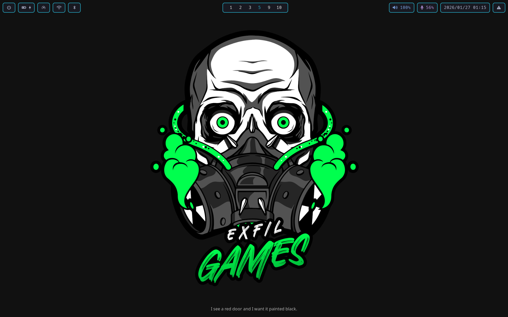

# .files

Personal dotfiles for an Arch + Hyprland workstation. Managed by
[krypt](https://github.com/kryptic-sh/krypt) — every install / update /
template-seed / hook is declared in `.krypt.toml` instead of a tangle of bash.



## Philosophy

Sleek modern Wayland setup. Hyprland tiling, Fish shell, Neovim + LazyVim,
TokyoNight throughout. Config is data: `.krypt.toml` and its included files
describe what lives where, what packages to install, and what commands the user
can invoke. krypt does the work; bash scripts only exist when the logic is
genuinely shell-shaped.

## Prerequisites

- **OS**: Arch Linux is the primary target. `.krypt/deps.toml` also maps
  packages for Debian/Ubuntu (apt), Fedora (dnf), macOS (Homebrew) and Windows
  (scoop, with PowerShell 7 and uutils coreutils standing in for fish), and CI
  resolves every package and installs the `core` group on each of them. Known
  gaps are in `docs/backlog.md`.
- **Display server**: Wayland (Hyprland). X11 unsupported.
- **CPU/GPU**: x86_64, any modern Wayland-capable GPU (tested on AMD).
- **CLI bootstrap**: `git`, `bash`, `curl`. Everything else `krypt setup`
  installs.

### Runtime assets (installed via `krypt deps`)

- **Font**: [Hack Nerd Font](https://www.nerdfonts.com/) (`ttf-hack-nerd`).
- **Cursor**: `Breeze_Light` (`breeze`).
- **GTK theme**: `adw-gtk-theme`.
- **Icon theme**: system default.

## Core Components

- **WM**: [Hyprland](https://hyprland.org/) — Wayland tiling compositor.
- **Shell**: [Fish](https://fishshell.com/).
- **Terminal**: [Alacritty](https://alacritty.org/).
- **Editor**: [Neovim](https://neovim.io/) +
  [LazyVim](https://www.lazyvim.org/).
- **Bar**: [Waybar](https://github.com/Alexays/Waybar).
- **Launcher**: [pikr](https://github.com/kryptic-sh/pikr) — vim-like fuzzy
  picker.
- **Notifications**: [swaync](https://github.com/Lentera/swaync).
- **File Manager**: [Nautilus](https://help.gnome.org/users/nautilus/).
- **Browser**: [Vieb](https://github.com/Jelmerro/Vieb).
- **Screenshot**: [Grimblast](https://github.com/hyprwm/contrib).
- **System monitor**: [btop](https://github.com/aristocratos/btop).
- **Prompt**: [Starship](https://starship.rs/).

## Install

### 1. Install krypt

| Platform | Command                                                                                             |
| -------- | --------------------------------------------------------------------------------------------------- |
| Arch     | `paru -S krypt-bin`                                                                                 |
| macOS    | `brew trust --tap kryptic-sh/tap` then `brew install kryptic-sh/tap/krypt`                          |
| Windows  | `scoop bucket add kryptic-sh https://github.com/kryptic-sh/scoop-bucket` then `scoop install krypt` |
| Any      | `cargo install krypt-cli`                                                                           |
| Manual   | grab a binary from [GH Releases](https://github.com/kryptic-sh/krypt/releases)                      |

On Windows, install [scoop](https://scoop.sh) first, in PowerShell as your own
user (no admin): `irm get.scoop.sh | iex`. `krypt deps` installs every Windows
package through it, per-user under `~\scoop`, so nothing asks for elevation.

The `.gitconfig` sets `core.symlinks = true`, which on Windows needs Developer
Mode so that git can create symlinks; without it, cloning or checking out a repo
that contains one fails with `unable to create symlink ... Permission denied`.
`krypt setup` and `krypt update` turn it on (`krypt system devmode`, one UAC
prompt, only when it is off). Git for Windows also writes
`core.symlinks = false` into the `.git/config` of each repo it clones where
symlinks were not allowed, which overrides the global setting there.

Verify: `krypt --version` should report `0.4.2` or newer, the `krypt_min` in
`.krypt.toml`.

### 2. Clone + link

```sh
krypt init https://github.com/mxaddict/dotfiles
krypt deps     # install this OS's packages
krypt setup    # interactive: git identity, Hyprland defaults, keyboard layout
krypt link     # copy this platform's files into place
```

`krypt setup` runs the `[prompts.*]` blocks in `.krypt.toml` and writes the
answers to the `[[template]]` destinations; sections whose templates belong to
another platform (the Hyprland ones outside Linux) are skipped. `krypt link`
deploys only the entries whose `platform` matches this OS.

### 3. Daily updates

```sh
krypt update          # pull repo, relink, run post-update hooks
krypt update --dry-run         # show plan, change nothing
krypt update --skip-hooks      # skip nvim/tmux/dconf/bat/etc. plugin syncs
```

Hooks declared in `.krypt.toml` (`[[hook]] when = "post-update"`) cover:

- mkdir essential `$HOME` dirs + `~/.local/log`
- fisher / nvim Lazy / tpm plugin syncs
- bat cache rebuild, tldr cache refresh
- dconf load from `dconf/user.ini`
- `hyprctl reload` (gated on hyprland running)
- Windows Developer Mode (`krypt system devmode`), which `krypt setup` also runs
  as a `post-setup` hook
- the kryptic-sh tools (`krypt deps --group kryptic`: hjkl, hrdr, gpur, ...),
  also a `post-setup` hook; every other deps group is installed only by running
  `krypt deps`

### Forking

`krypt init` accepts any HTTPS / SSH git URL. Point it at your fork.

## Migration from the old stow-bash version

If you used `.files` before krypt landed (`.update` / `.setup` bash scripts):

1. `paru -S krypt-bin` (or your platform's install)
2. `git -C ~/.files pull`
3. `krypt update` — replaces the old `.update` chain; reloads hyprland if active
4. Existing `~/.config/hypr/{apps,input,monitors,hyprpaper}.conf` etc. stay
   untouched (gitignored, krypt does not overwrite seeded files)

Bash scripts in `.local/bin/.*` (e.g. `.menu-power`, `.kanata`, `t`) **stay on
disk** — krypt invokes them via `[[command]]` entries. They get full
`shellcheck` + `ft=bash` treatment instead of being inlined into TOML strings.

The Hyprland keybinds in `hyprland.lua` now invoke `krypt menu <name>` instead
of the scripts directly. Same for waybar `on-click` handlers.

## Templates (user-specific, gitignored)

`krypt setup` seeds these from `*.template.*` files on first run. Re-running is
safe — krypt only seeds files that don't exist yet.

| Template (repo)                        | Destination                     | Purpose                         |
| -------------------------------------- | ------------------------------- | ------------------------------- |
| `.gitconfig.local.template`            | `~/.gitconfig.local`            | Name, email, GPG                |
| `.config/hypr/apps.template.lua`       | `~/.config/hypr/apps.lua`       | Terminal, browser, file manager |
| `.config/hypr/input.template.lua`      | `~/.config/hypr/input.lua`      | Keyboard layout                 |
| `.config/hypr/monitors.template.lua`   | `~/.config/hypr/monitors.lua`   | Monitor positions               |
| `.config/hypr/hyprpaper.template.conf` | `~/.config/hypr/hyprpaper.conf` | Wallpaper                       |

### Files to edit per-machine

1. `~/.gitconfig.local` — identity + signing.
2. `~/.config/hypr/monitors.lua` — `hyprctl monitors` to discover names.
3. `~/.config/hypr/apps.lua` — terminal / browser / file manager defaults.
4. `~/.config/hypr/input.lua` — change `kb_layout` if not US.

Optional:

- `~/.config/hypr/workspaces.lua` — pin workspaces to monitors.
- `~/.config/hypr/hyprpaper.conf` — wallpaper path.
- `.codex/config.toml`, `.config/opencode/opencode.json` — Ollama host.

## Keybinding cheatsheet (Hyprland)

`$mod` = **Super** (Windows key). Every menu binding invokes `krypt menu <name>`
or another krypt subcommand — see `.krypt/commands.toml` for the underlying
step. `$mod + /` opens a cheatsheet of these binds, read each time it opens:
Hyprland's running binds from `hyprctl binds` (tagged `Hyprland`), and the binds
the deployed `tmux.conf` and its plugins add, in any key table (tagged `tmux`,
or `tmux copy-mode`). Descriptions come from each bind's `description` /
`bind -N` note, and from `.config/tmux/plugin-notes.sh` for plugin binds.

### Apps & menus

| Bind                  | krypt invocation       | Action                  |
| --------------------- | ---------------------- | ----------------------- |
| `$mod + return` / `c` | —                      | Alacritty               |
| `$mod + b`            | —                      | Browser                 |
| `$mod + e`            | —                      | Nautilus                |
| `$mod + space`        | `krypt menu apps`      | App launcher            |
| `$mod + r`            | `krypt menu calc`      | qalculate picker        |
| `$mod + .`            | `krypt menu emoji`     | Emoji picker            |
| `$mod + w`            | `krypt menu wifi`      | WiFi picker             |
| `$mod + a`            | `krypt menu audio`     | wiremix                 |
| `$mod + u`            | `krypt menu bluetooth` | bluetui                 |
| `$mod + t`            | `krypt menu time`      | Timezone picker         |
| `$mod + escape`       | `krypt menu top`       | btop                    |
| `$mod + shift + m`    | `krypt menu power`     | Power picker            |
| `$mod + /`            | `krypt menu keys`      | Keybinding cheatsheet   |
| `$mod + n` / `+S+n`   | —                      | swaync toggle / dismiss |
| `ctrl + shift + k`    | `krypt kanata toggle`  | Toggle kanata.service   |

### Autofill (pass + wtype)

| Bind              | krypt invocation              |
| ----------------- | ----------------------------- |
| `$mod + ctrl + j` | `krypt menu autofill -- auth` |
| `$mod + ctrl + k` | `krypt menu autofill -- user` |
| `$mod + ctrl + l` | `krypt menu autofill -- pass` |
| `$mod + ctrl + ;` | `krypt menu autofill -- otp`  |

### Screen

| Bind                 | Action                        |
| -------------------- | ----------------------------- |
| `$mod + p` / `Print` | Screenshot region (grimblast) |
| `$mod + shift + p`   | Screen record (kooha)         |
| `$mod + ctrl + p`    | Color picker                  |
| `$mod + m`           | Lock screen                   |

### Window management

| Bind                     | Action                   |
| ------------------------ | ------------------------ |
| `$mod + q`               | Close active             |
| `$mod + f`               | Maximize                 |
| `$mod + shift + f`       | True fullscreen          |
| `$mod + v`               | Toggle floating          |
| `$mod + s`               | Toggle split direction   |
| `$mod + h/j/k/l`         | Focus left/down/up/right |
| `$mod + shift + h/j/k/l` | Move window              |
| `ctrl + arrows`          | Resize                   |
| `$mod + tab`             | Cycle windows            |

### Workspaces

| Bind                  | Action                    |
| --------------------- | ------------------------- |
| `$mod + 1..9,0`       | Switch to workspace 1..10 |
| `$mod + shift + 1..0` | Move window to workspace  |
| `$mod + LMB drag`     | Move window               |
| `$mod + RMB drag`     | Resize window             |

### Audio / brightness

`XF86Audio*` and `XF86MonBrightness*` wired via `swayosd-client`.
`$mod + up/down/left/right` doubles as volume +/-/mute. Add `shift` for mic.

## `.krypt.toml` layout

Top-level `.krypt.toml` declares `[meta]`, `[paths]`, `[prompts.*]`, and
`[[template]]` entries, and includes three sub-files:

| File                   | Holds                                                                  |
| ---------------------- | ---------------------------------------------------------------------- |
| `.krypt/links.toml`    | `[[link]]` symlink rules (`stow` replacement)                          |
| `.krypt/deps.toml`     | `[[deps]]` groups: cross-distro package mappings                       |
| `.krypt/commands.toml` | `[[command]] group=… name=…` — every `krypt <group> <name>` invocation |

`[[hook]] when = "post-update"` entries live in the top-level `.krypt.toml`.

To add a new menu (e.g. `krypt menu screenshot`):

1. Add `[[command]] group = "menu" name = "screenshot" steps = […]` to
   `.krypt/commands.toml`.
2. (Optional) Add the Hyprland bind in `.config/hypr/hyprland.lua`:
   `hl.bind("SUPER + SHIFT + S", hl.dsp.exec_cmd("krypt menu screenshot"), { description = "Screenshot menu" })`.
   Give every bind a `description` — `krypt menu keys` (`$mod + /`) lists them
   as the live cheatsheet.
3. `krypt validate` — fail fast on config errors.

## Convention: dotfile-prefixed scripts

Scripts in `.local/bin/` are intentionally named with a leading `.` (e.g.
`.menu-apps`, `.kanata`). Hidden from `ls` but show with `ls -A`. Keeps the
user's interactive PATH visually clean while still being invocable from
`.krypt.toml`.

## Contributing

See [CONTRIBUTING.md](CONTRIBUTING.md) for commit style, naming, lint.

## License

MIT — see [LICENSE](LICENSE).
